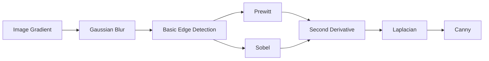

<div align="center">

# 🔍 Edge Detection in Digital Image Processing

### *A Step-by-Step Educational Guide to Classical Edge Detection Algorithms*


</div>

---

> **Learning Goal**
>
> This repository is an educational collection of Jupyter notebooks that explains the theory and implementation of classical edge detection methods. The lessons begin with image gradients and gradually introduce Gaussian smoothing, first-order derivatives, second-order derivatives, Laplacian, and the Canny Edge Detector.

---

# 📚 Table of Contents

- Introduction
- Why Edge Detection?
- Learning Roadmap
- Notebook Contents
- Edge Detector Comparison
- Technologies
- Installation
- Learning Outcomes
- References
- License

---

# 📖 Introduction

Edge detection identifies locations where image intensity changes rapidly. These changes usually correspond to object boundaries, corners, textures, or meaningful structures.

Instead of processing every pixel equally, edge detection extracts the structural information of an image, making it one of the most important preprocessing steps in Computer Vision.

Applications include:

- Object Detection
- Image Segmentation
- Feature Extraction
- Medical Imaging
- Autonomous Driving
- OCR
- Robotics

---

# 🎯 Learning Objectives

After completing these notebooks you will understand:

- Image gradients
- Gaussian smoothing
- First-order derivatives
- Second-order derivatives
- Zero-crossings
- Prewitt operator
- Sobel operator
- Laplacian operator
- Canny Edge Detector

---

# 🧭 Learning Roadmap



---

# 📖 Notebook Contents

| Topic | Description |
|------|-------------|
| **Image Gradient** | Learn how intensity changes are represented mathematically through gradients. Explore gradient magnitude and direction as the foundation of edge detection. |
| **Gradient + Blur Impact** | Understand how Gaussian Blur suppresses noise and improves gradient estimation while preserving important structures. |
| **Basic Edge Detection** | Learn how gradients are converted into edge maps using thresholding and intensity discontinuities. |
| **Edge Detection Variations** | Observe how different parameters influence detected edges and compare the resulting edge maps. |
| **Gaussian + Edge Detection** | Study why Gaussian filtering is commonly applied before edge detection and compare results before and after smoothing. |
| **Prewitt & Sobel** | Explore two first-order derivative operators. Prewitt provides a simple approximation, while Sobel uses weighted kernels for improved robustness against noise. |
| **Second Derivatives** | Learn how edges can be detected through zero-crossings instead of gradient magnitude and understand why second derivatives amplify noise. |
| **Laplacian** | Study an orientation-independent second-order operator that highlights edges in all directions and is commonly paired with Gaussian smoothing. |
| **Canny Edge Detector** | Learn the complete multi-stage pipeline: Gaussian smoothing, gradient computation, non-maximum suppression, double thresholding, and hysteresis for accurate, thin, continuous edges. |

---

# 📊 Edge Detector Comparison

| Detector | Principle | Advantages | Limitations |
|-----------|-----------|------------|-------------|
| Gradient | Intensity change | Simple and intuitive | Sensitive to noise |
| Prewitt | First derivative | Fast and easy | Lower accuracy |
| Sobel | Weighted first derivative | Better localization | Slightly higher computation |
| Laplacian | Second derivative | Detects edges in all directions | Highly sensitive to noise |
| Canny | Multi-stage | Excellent accuracy and noise suppression | Computationally more expensive |

---

# ⭐ Key Features

- Progressive educational structure
- Mathematical intuition
- Practical Python implementation
- Visualization with Matplotlib
- OpenCV-based examples
- Notebook-by-notebook learning path

---

# 💻 Technologies

- Python
- OpenCV
- NumPy
- Matplotlib
- Jupyter Notebook

---

# 📦 Installation

```bash
pip install opencv-python numpy matplotlib notebook
```

---

# 🎯 Learning Outcomes

By the end of this repository you should be able to:

- Explain image gradients
- Detect edges using classical operators
- Compare first- and second-order methods
- Implement Prewitt, Sobel, Laplacian, and Canny
- Select suitable edge detectors for different computer vision tasks

---

# 📚 References

- Richard Szeliski — Computer Vision: Algorithms and Applications
- Rafael C. Gonzalez — Digital Image Processing
- OpenCV Documentation

---

# 📄 License

This repository is intended for educational purposes and may be freely used for learning and research.
