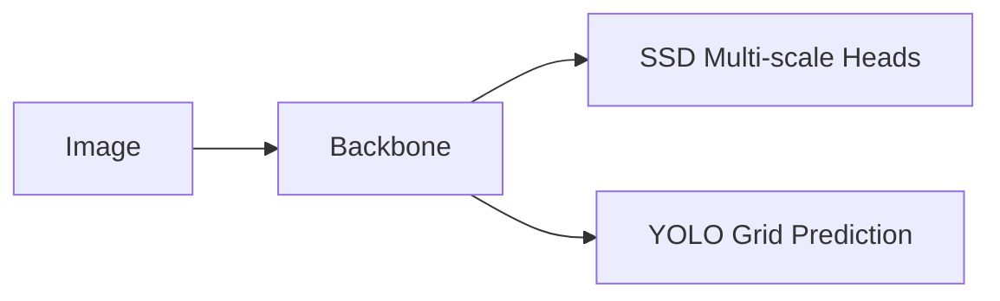

# SSD300 & YOLO (Introduction)

## Contents
- Introduction
- One-Stage vs Two-Stage Detectors
- SSD300
- Default Boxes
- Multi-scale Feature Maps
- Matching Strategy
- Loss Function
- Advantages & Disadvantages
- YOLO Introduction
- Grid-based Detection
- Bounding Box Prediction
- Confidence Score
- Non-Maximum Suppression (NMS)
- SSD vs YOLO
- References

# Introduction
SSD (Single Shot MultiBox Detector) and YOLO (You Only Look Once) are one-stage object detectors designed for real-time detection.

# Two-Stage vs One-Stage

| Method | Examples | Speed | Accuracy |
|---|---|---:|---:|
| Two-Stage | R-CNN Family | Medium | High |
| One-Stage | SSD, YOLO | Very High | High |

# SSD300

SSD300 receives a 300×300 image and predicts bounding boxes directly from multiple feature maps.

## Backbone
Original SSD300 uses VGG16.

## Multi-scale Detection
Different feature maps detect objects of different sizes.

## Default Boxes
Each cell predicts multiple anchor/default boxes with various scales and aspect ratios.

## Matching
Ground-truth boxes are matched to default boxes using IoU.

## Loss
Total Loss = Localization Loss + Confidence Loss.

### Advantages
- Fast
- Multi-scale detection
- End-to-end

### Disadvantages
- Weak on very small objects
- Requires anchor tuning

# YOLO (Introduction)

YOLO treats detection as a single regression problem.

Pipeline:
1. Input image
2. CNN
3. Grid prediction
4. Bounding boxes
5. Class probabilities
6. NMS

## Grid System
The image is divided into grid cells.
Each cell predicts boxes and confidence.

## Confidence Score
Confidence = Objectness × IoU.

## Non-Maximum Suppression
Removes duplicated detections by keeping the highest-confidence box.

# SSD vs YOLO

| Feature | SSD300 | YOLO (v1 concept) |
|---|---|---:|
| Input | 300x300 | 448x448 |
| Detector | Anchor-based | Grid-based |
| Multi-scale | Yes | No (v1) |
| Speed | Very Fast | Extremely Fast |
| Small Objects | Better | Weaker |

# References
- SSD: Single Shot MultiBox Detector (ECCV 2016)
- YOLO: You Only Look Once (CVPR 2016)
